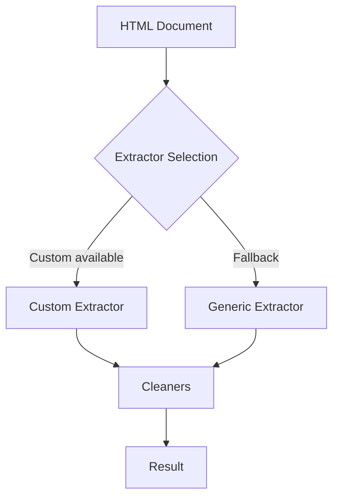

# Extractors (Internal Overview)

Hermes uses an internal extractor system to identify and retrieve article fields from HTML documents. This system is not a public API — it is an implementation detail of the library.

If you are using Hermes as a library or via the CLI, you do not need to interact with extractors directly. Use the public client methods documented in [Hermes API](hermes.md), and see [Architecture Overview](../architecture/overview.md) for details on how extractors work internally.

## Summary

- Custom extractors: site-specific rules for well-known domains.
- Generic extractors: algorithmic fallback for all other sites.
- Field cleaners: normalize extracted values (title, author, date, etc.).
- No public configuration for extractors; behavior is automatic.

