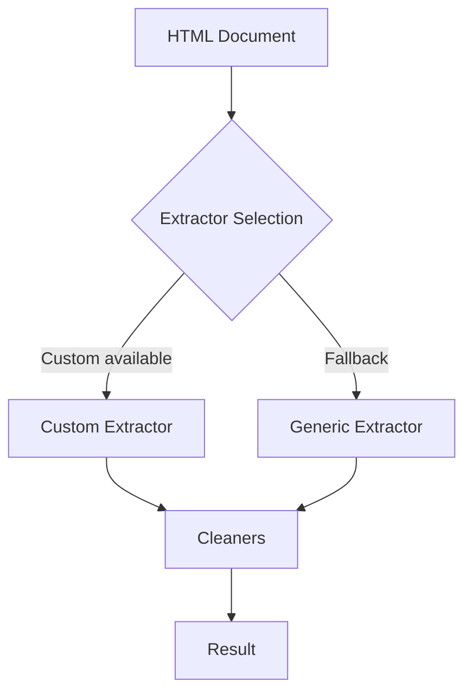

# Internal extractors

Hermes uses internal extractors to retrieve article fields from HTML documents. Extractors are not a public API.

Use the public client methods in [Hermes API](hermes.md) to extract content. See [Architecture overview](../architecture/overview.md) for the internal design.

## Summary

- Custom extractors apply site-specific rules.
- Generic extractors provide fallback rules.
- Field cleaners normalize extracted values such as titles, authors, and dates.

Hermes selects extractors without public configuration.

