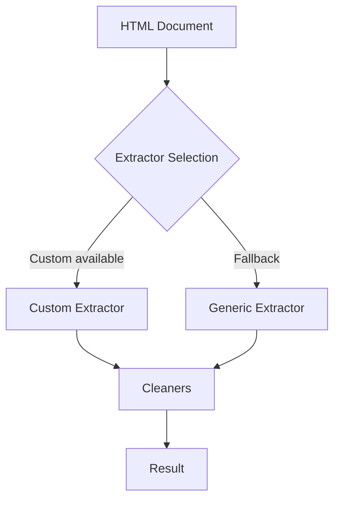

# Internal extractors

Hermes uses internal extractors to retrieve article fields from HTML documents. Extractors are not a public API.

Use the public client methods in [Hermes API](hermes.md) to extract content. See [Architecture overview](../architecture/overview.md) for the internal design.

## Summary

- Custom extractors apply site-specific rules.
- Generic extractors provide fallback rules.
- Field cleaners normalize extracted values such as titles, authors, and dates.

Hermes selects extractors without public configuration.

## Extraction contracts

Custom metadata selectors use `SelectorEntry` values with a CSS selector and an optional attribute name.
Each selector reads only the first matched element. Title, author, and image fields stop at the first nonempty raw value.
Date selectors continue until a value passes date conversion.

Custom content selectors use ordered `ContentSelectorGroup` values. Each group combines its selectors in source order and excludes duplicate elements.
The first group with nonempty raw content controls extraction, even if cleanup removes that content.

Theme color extraction accepts standard `content` attributes and normalized `value` attributes. The `theme-color` tag has priority over `msapplication-TileColor`.

Generic content cleanup operates on a copy of the selected article. It preserves the source document and excludes unrelated page elements from cleanup.
The returned content includes absolute links and the existing image, header, tag, empty-element, and attribute cleanup rules.
Relative article URLs use the source document's first `<base href>` value, when present.
Relative base references resolve against the page URL before article links and images become absolute.
If no source HTML is supplied, generic extraction captures the document before candidate extraction. Retries use that source to preserve short article content.
The final relaxed retry disables conditional cleanup so short tables and other article elements can remain in the result.
This correction does not change public methods or JSON fields.

Internal parser calls with empty options retain default fallback extraction. An explicit content type preserves `Fallback: false`.
The parser does not treat that choice as empty options.

