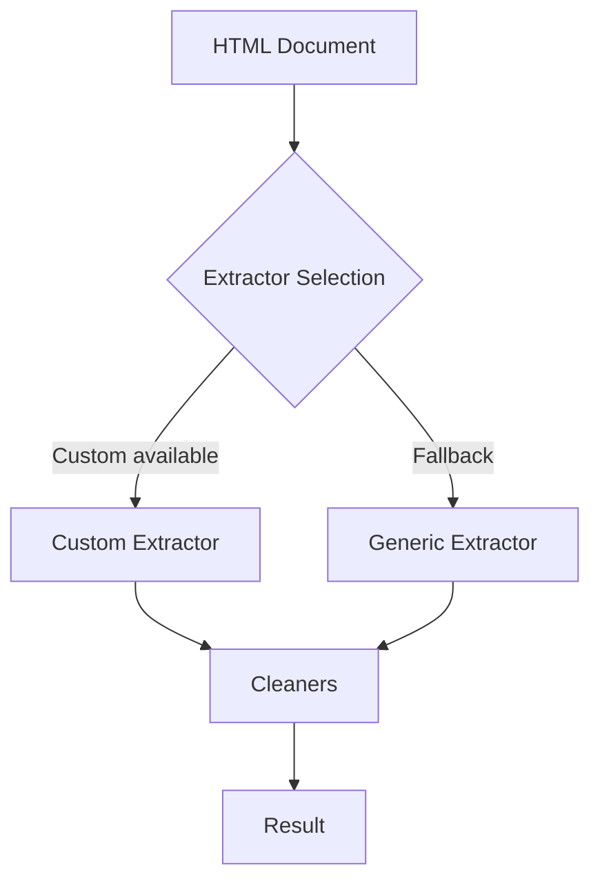

# Extractors (Internal Overview)

Hermes uses an internal extractor system to identify and retrieve article fields from HTML documents. This system is not a public API — it is an implementation detail of the library.

If you are using Hermes as a library or via the CLI, you do not need to interact with extractors directly. Use the public client methods documented in [Hermes API](hermes.md), and see [Architecture Overview](../architecture/overview.md) for details on how extractors work internally.

## Summary

- Custom extractors: site-specific rules for well-known domains.
- Generic extractors: algorithmic fallback for all other sites.
- Field cleaners: normalize extracted values (title, author, date, etc.).
- No public configuration for extractors; behavior is automatic.

## Extraction contracts

Theme color extraction accepts standard `content` attributes and normalized `value` attributes. The `theme-color` tag has priority over `msapplication-TileColor`.

Generic content cleanup operates on a copy of the selected article. It preserves the source document and excludes unrelated page elements from cleanup.
The returned content includes absolute links and the existing image, header, tag, empty-element, and attribute cleanup rules.
Relative article URLs retain the source document's first `<base href>` value, when present.
If no source HTML is supplied, generic extraction captures the document before candidate extraction. Retries use that source to preserve short article content.
This correction does not change public methods or JSON fields.

Internal parser calls with empty options retain default fallback extraction. An explicit content type preserves `Fallback: false`.
The parser does not treat that choice as empty options.

