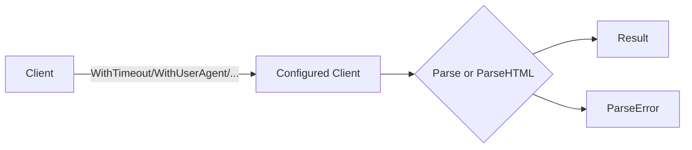

# Hermes API Reference

The `github.com/BumpyClock/hermes` package exposes a small, stable API for extracting clean, structured content from web pages.

## Table of Contents

- [Client](#client)
- [Options](#options)
- [Parsing](#parsing)
- [Results](#results)
- [Errors](#errors)

## Client

```go
type Client struct { /* ... */ }

func New(opts ...Option) *Client
```

Creates a reusable, thread-safe client. Share a single client across goroutines.

Example:
```go
client := hermes.New(
    hermes.WithTimeout(30 * time.Second),
    hermes.WithUserAgent("MyApp/1.0"),
)
```

## Options

Hermes uses functional options to configure the client:

```go
type Option func(*Client)

func WithHTTPClient(httpClient *http.Client) Option
func WithTransport(transport http.RoundTripper) Option
func WithTimeout(timeout time.Duration) Option
func WithUserAgent(userAgent string) Option
func WithAllowPrivateNetworks(allow bool) Option
func WithContentType(contentType string) Option // "html" | "markdown" | "text"
```

- WithHTTPClient: Provide a custom `*http.Client` (timeouts, proxies, pools).
- WithTransport: Set a custom transport if not using a full client.
- WithTimeout: Set request timeout.
- WithUserAgent: Set the `User-Agent` header.
- WithAllowPrivateNetworks: Allow parsing of private/localhost URLs (default: false).
- WithContentType: Choose output format for `Result.Content` (default: `"html"`).

## Parsing

```go
func (c *Client) Parse(ctx context.Context, url string) (*Result, error)
func (c *Client) ParseHTML(ctx context.Context, html, url string) (*Result, error)
```

- Parse: Fetches the URL and extracts content.
- ParseHTML: Extracts from pre-fetched HTML with the given base URL.

Examples:
```go
// Parse a URL
ctx := context.Background()
res, err := client.Parse(ctx, "https://example.com/article")
if err != nil { /* handle */ }
fmt.Println(res.Title)

// Parse pre-fetched HTML
html := "<html>...</html>"
res, err := client.ParseHTML(ctx, html, "https://example.com")
```

Concurrency pattern (limit with a semaphore):
```go
sem := make(chan struct{}, 10)
var wg sync.WaitGroup
for _, u := range urls {
    wg.Add(1)
    sem <- struct{}{}
    go func(url string) {
        defer wg.Done()
        defer func(){ <-sem }()
        res, err := client.Parse(ctx, url)
        _ = res; _ = err
    }(u)
}
wg.Wait()
```

## Results

See [Results](results.md) for all fields and helper methods.

Key fields include `Title`, `Content`, `Author`, `DatePublished`, `LeadImageURL`, `Domain`, `Excerpt`, `WordCount`, `Language`, `Favicon`, `VideoURL`, and more.

## Errors

Hermes returns typed errors to simplify handling:

```go
type ErrorCode int

const (
    ErrInvalidURL ErrorCode = iota
    ErrFetch
    ErrTimeout
    ErrSSRF
    ErrExtract
    ErrContext
)

type ParseError struct {
    Code ErrorCode
    URL  string
    Op   string // "Parse" or "ParseHTML"
    Err  error  // underlying error (optional)
}
```

Usage:
```go
res, err := client.Parse(ctx, url)
if err != nil {
    var perr *hermes.ParseError
    if errors.As(err, &perr) {
        switch perr.Code {
        case hermes.ErrTimeout:
            // handle timeout
        case hermes.ErrSSRF:
            // handle SSRF protection
        }
    }
}
```

## Relationships



