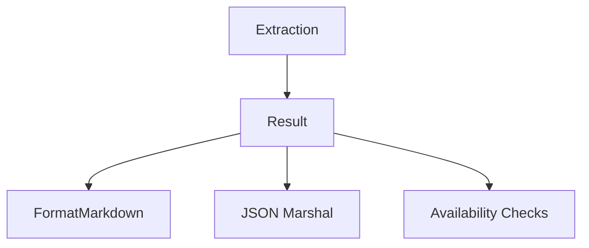

# Results API Reference

This document covers the `Result` structure and related helpers for working with extracted content.

## Table of Contents

- [Structure](#structure)
- [Field Details](#field-details)
- [Methods](#methods)
- [JSON](#json)

## Structure

```go
type Result struct {
    // Core content fields
    URL           string     `json:"url"`
    Title         string     `json:"title"`
    Content       string     `json:"content"`
    Author        string     `json:"author,omitempty"`
    DatePublished *time.Time `json:"date_published,omitempty"`

    // Media and metadata
    LeadImageURL string `json:"lead_image_url,omitempty"`
    Dek          string `json:"dek,omitempty"`
    Domain       string `json:"domain"`
    Excerpt      string `json:"excerpt,omitempty"`

    // Content metrics
    WordCount     int    `json:"word_count"`
    Direction     string `json:"direction,omitempty"`
    TotalPages    int    `json:"total_pages,omitempty"`
    RenderedPages int    `json:"rendered_pages,omitempty"`

    // Site information
    SiteName    string `json:"site_name,omitempty"`
    Description string `json:"description,omitempty"`
    Language    string `json:"language,omitempty"`
    ThemeColor  string `json:"theme_color,omitempty"`
    Favicon     string `json:"favicon,omitempty"`

    // Video metadata
    VideoURL      string                 `json:"video_url,omitempty"`
    VideoMetadata map[string]interface{} `json:"video_metadata,omitempty"`
}
```

## Field Details

- Title: Article headline.
- Content: Extracted content body (format depends on client `WithContentType`).
- Author: Author name(s).
- DatePublished: Publication date (if available).
- LeadImageURL: Primary article image URL.
- Dek: Subtitle/deck.
- Domain: Domain of the URL.
- Excerpt: Short excerpt/summary.
- WordCount: Word count of the content.
- Direction: Text direction (`"ltr"` or `"rtl"`).
- TotalPages/RenderedPages: Pagination metadata when detected.
- SiteName/Description/Language/ThemeColor/Favicon: Site-level metadata derived from meta tags/structured data.
- VideoURL/VideoMetadata: Video information when present.

## Methods

```go
func (r *Result) FormatMarkdown() string
func (r *Result) IsEmpty() bool
func (r *Result) HasAuthor() bool
func (r *Result) HasDate() bool
func (r *Result) HasImage() bool
```

- FormatMarkdown: Convenience for a single-document Markdown export including metadata and content.
- IsEmpty: True when no meaningful content was extracted.
- HasAuthor/HasDate/HasImage: Quick availability checks.

## JSON

Results are standard Go structs and can be serialized with `encoding/json`:

```go
data, err := json.MarshalIndent(res, "", "  ")
if err != nil { /* handle */ }
fmt.Println(string(data))
```

Note: The `DatePublished` field serializes as RFC3339 when set by default JSON marshalling.



