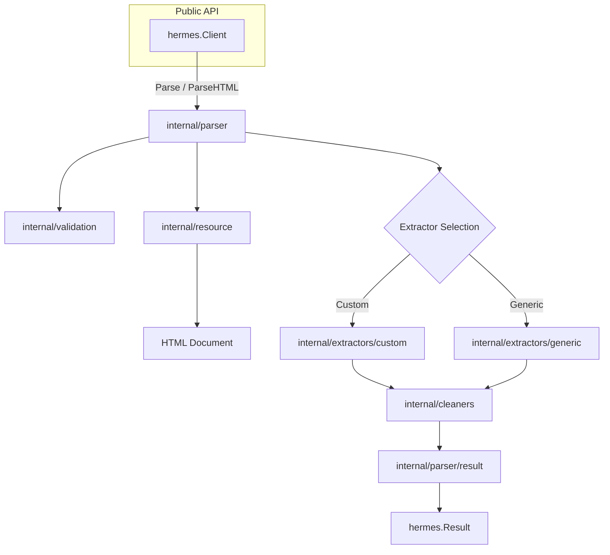
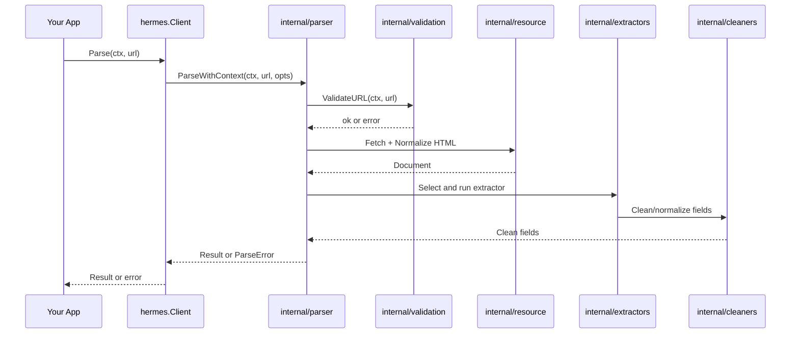

# Architecture Overview

This overview describes how Hermes is organized internally and how a parse request flows through the system.

## Components

- `hermes.Client`: Public entry point. Manages HTTP client configuration and orchestrates parsing.
- `internal/resource`: Fetching, encoding detection, and DOM preparation.
- `internal/extractors`: Extractor selection (custom vs generic) and field extraction.
- `internal/cleaners`: Field-specific cleaning and normalization.
- `internal/parser`: Orchestration of extraction and result assembly.
- `internal/validation`: URL validation and SSRF protection.
- CLI (`cmd/hermes`): Thin wrapper around the client with concurrency and formatting options.

## System Diagram

## Parse Flow

## Notes on Behavior

- Concurrency: The client is safe to share; use your own goroutines to parallelize parsing.
- Formats: Content format (HTML/Markdown/Text) is selected via `WithContentType`.
- Security: Private network access is blocked by default; enable only when necessary using `WithAllowPrivateNetworks`.

