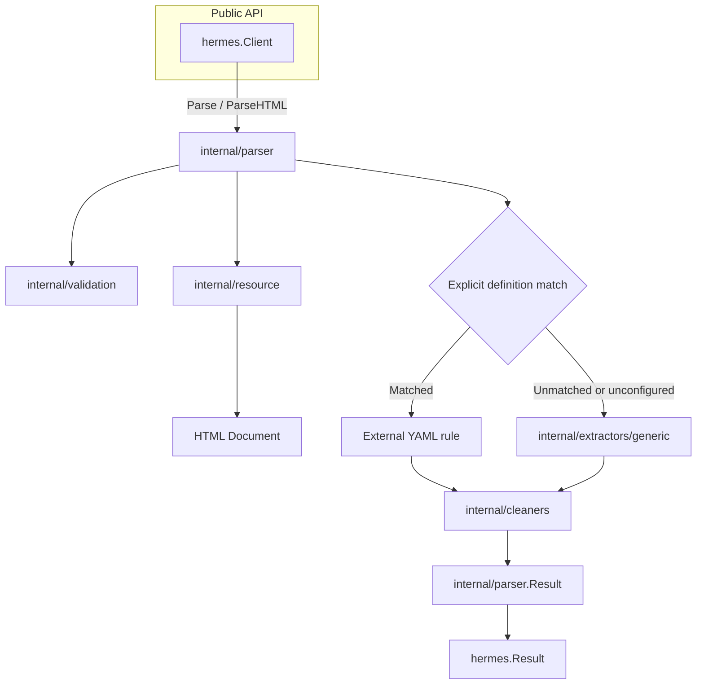
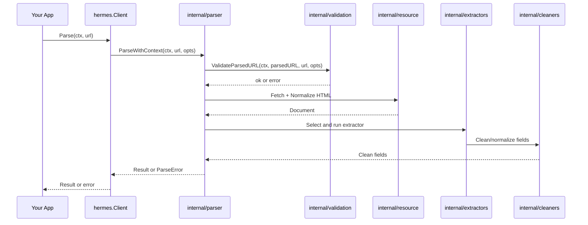

# Architecture overview

Hermes separates its public client, resource access, extraction, and result conversion into these components.

## Components

| Component | Role |
| --- | --- |
| `hermes.Client` | Provides the public API and HTTP client configuration. |
| `internal/resource` | Fetches HTML, detects character encoding, and prepares the DOM. |
| `internal/extractors` | Defines shared external-definition rule types; `internal/extractors/generic` provides default extraction. |
| `internal/cleaners` | Cleans and normalizes extracted fields. |
| `internal/parser` | Selects extractors, coordinates extraction, and assembles results. |
| `internal/validation` | Validates URLs against scheme, host, and network rules. |
| `cmd/hermes` | Provides the CLI with concurrency and output format options. |

## Component relationships

## Parse request

## Internal extraction stages

The resource package uses functions, not a resource object. `Fetch` returns a response and an ordinary error.
Request headers override client headers, which override defaults; header names are case-insensitive, and input maps remain unchanged.
`PrepareDocument` accepts bytes, content type, and the decoded-input flag. Supplied HTML skips character decoding.

The parser extracts metadata sequentially within each request. Separate requests can still execute concurrently through the public client.
Direct internal parser calls without a supplied HTTP client lazily share one default client per parser instance.
Supplied clients remain authoritative, and parsing supplied HTML does not initialize the default client.
Definition and generic paths share content conversion, content metrics, author/date fallback, and video result assembly.
Unconfigured clients never select compiled site rules; snapshots are selected before client construction and remain immutable for the client's lifetime.

The cleaner package owns title separator and domain-similarity algorithms. Generic title extraction retains its distinct tag-removal and whitespace order.
The parser retains repeated title cleanup where that sequence affects results.

See [refactor comparison](../development/refactor-comparison.md) for output and public-contract checks.

## Client behavior

The client supports concurrent requests. Reuse a client across goroutines to share its HTTP connection pool.

`WithContentType` selects HTML, Markdown, or text for the extracted content.

URL validation rejects private network addresses by default. Enable `WithAllowPrivateNetworks` only in trusted environments that require private network access.

See [security limitations](../api/configuration.md#security) for redirect and DNS constraints.

`ParseHTML` accepts HTML from the caller instead of a URL fetch. It still validates the supplied URL before extraction.
